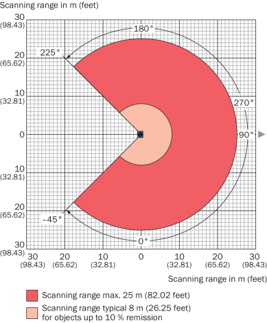

# Hints for Usage 

## Introduction

This code illustrates how SICK scanners can be parameterised. 
The code is designed in such a way that dependencies to external libraries are not necessary for the core functionality. 
For this reason, the code can also be executed under Windows and Linux. 

## Examples

The src/examples directory contains a number of sample programs that illustrate the use of this sample code.

Example 5 shows how to use the driver to create a CSV file and a bird's eye view of the scan. 
The usage of example 5 is explained in more detail below.

## Example 5

### Installation

To install, follow the steps below:

1. clone repository
```console
git clone https://github.com/SICK AG, Waldkirch/ssbl.git
```
2. create Makefile by using cmake
```console
cd ssbl
cmake .
```
3. compile the software

```console
make
```


### Running

1. Start software e.g. with
```console
5_scan_dump_example ./launch/sick_mrs_1xxx.launch hostname:=192.168.0.72
```

In general the software starts with the following options:

```console
5_scan_dump_example <launch-file> [<tag1>:=<value1>] [<tag2>:=<value>] ... [<tagn>:=<valuen>]
```

The tag/value pairs overwrite the settings in the launch file.

### Parameters

For the launch-file settings and the tag/values pairs the following keywords are supported:

| Keyword      |     Meaning     |  Default value |    Hint       |
|--------------|-----------------|----------------|---------------|
| min_ang_deg  |  Start scan angle in [deg] |  -45    |  |
| max_ang_deg  |  End scan angle in [deg] |  +225 |  |
| hostname | Ip address of scanner  | 192.168.0.1 | change to scanner ip address in your network (see faq) |

The launch-file is similar to a standard ros1 launch file. An example of a valid launch file can be found [here](sick_tim_5xx.launch)

### Results

As a result, a CSV file and a bird's eye view map are generated as a JPEG file. The CSV file is stored under "scan.csv". The image file is stored under "scan.jpg". 
Here are example for [scan.jpg](scan.jpg) and [scan.csv](scan.csv).

### Remarks for handling of angles

The configuration setting for min_ang_deg and max_ang_deg are given in degress in the orientation of the SICK working area definition:



For internal calculation of x- and y-coordinate we convert the scan angle to a coordinate system which is defined by the so-called "Local east, north, up (ENU) coordinates"
(see [https://en.wikipedia.org/wiki/Local_tangent_plane_coordinates] and [https://www.ros.org/reps/rep-0103.html]) 

The "working area angle" is converted to the "azimuth angle" by the following formula:

```console
azimuth angle = working area angle - 90°
```
  
The following figure shows the azimuth angle definition:


## Ideas and Questions

* [DONE] start and stop angles and ip address could be moved to config files

* How can one scan for available devices?

* How can one handle the switching between ASCII and BINARY Sopas mode?

* How can I see "bytes on wire"?

* How can I handle scanner with multiple layers?

* How can I configure the debug level?

* How can we add more scanner types?

* myScanConfig_t could be changed to an singleton.

* Should we annotate the bird's eye view image with a legend, title, axis description etc.?

* Should we emulate a scanner in the software (i.e. a simple emulation without any ip traffic)?

* How can we separate the threads for receiving datagrams from the processing thread that stores the data? (Fifo, thread handling)

* How can we migrate to sick_scan_base?

* How can we implement continuous integration?


